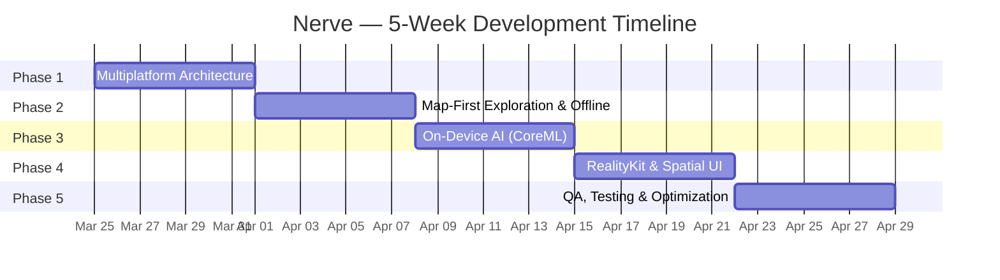

# Nerve — Development Roadmap

> **Timeline:** 5 Weeks  
> **Last Updated:** March 25, 2026  
> **Project Overview:** See [README.md](README.md)

---

This document is the **engineering execution plan** for Nerve. It details what to build, in what order, and the acceptance criteria for each phase. For project overview, architecture diagrams, and tech stack, refer to the [README](README.md).



---

## Phase 1 — Multiplatform Architecture & Modular Foundation

**Week 1 · March 25 – March 31, 2026**

### Goal

Establish a clean, scalable architecture that feeds iOS, macOS, and visionOS from a **single codebase** using Swift Package Manager (SPM) and Swift Concurrency.

### Technology Stack

| Technology                  | Purpose                                                  |
| --------------------------- | -------------------------------------------------------- |
| Swift Package Manager       | Modular dependency graph across all targets              |
| Swift Concurrency           | `async/await`, `Actor` isolation, structured concurrency |
| Xcode Multiplatform Targets | Unified project with iOS, macOS, visionOS destinations   |

> **Architecture:** See [README.md → Architecture](README.md#architecture) for the full module tree and data flow diagram.

### Deliverables

#### 1.1 — Project Bootstrapping

- [x] Create Xcode project with **iOS**, **macOS**, and **visionOS** targets.
- [x] Configure shared build settings (deployment targets, signing, capabilities) for all three platforms.
- [x] Set up `.xcode-version` and pin to a stable Xcode release for team consistency.

#### 1.2 — SPM Package Decomposition

- [ ] Create six local SPM packages: `Core`, `NetworkLayer`, `StorageLayer`, `MapFeature`, `ARFeature`, `AILayer`.
- [ ] Define `Package.swift` for each module with explicit platform declarations:

```swift
// Example: Core/Package.swift
let package = Package(
    name: "Core",
    platforms: [
        .iOS(.v17),
        .macOS(.v14),
        .visionOS(.v1)
    ],
    products: [
        .library(name: "Core", targets: ["Core"])
    ],
    targets: [
        .target(name: "Core"),
        .testTarget(name: "CoreTests", dependencies: ["Core"])
    ]
)
```

- [ ] Establish the **dependency graph** between modules (e.g., `MapFeature` depends on `Core`, `NetworkLayer`, `StorageLayer`).
- [ ] Validate that each package compiles independently for all three platform destinations.

#### 1.3 — Dependency Injection & UI Isolation

- [ ] Implement a lightweight **DI Container** in `Core` (protocol-based, no third-party frameworks).
- [ ] Define service protocols (e.g., `NewsServiceProtocol`, `LocationServiceProtocol`, `StorageServiceProtocol`) in `Core`.
- [ ] Ensure **zero UIKit/SwiftUI imports** in `Core`, `NetworkLayer`, `StorageLayer`, and `AILayer`.
- [ ] Wire up the container at the app-entry point (`NerveApp.swift`) using `@Environment` for SwiftUI injection.

### Acceptance Criteria

- [x] All six packages compile successfully for iOS, macOS, and visionOS.
- [x] `Core` module has no UI dependencies.
- [x] A trivial "Hello World" view renders on all three platforms using shared logic from `Core`.

---

## Phase 2 — Map-First Exploration & Offline-First Data Layer

**Week 2 · April 1 – April 7, 2026**

### Goal

Transform the app's main screen into a **high-performance interactive map** that clusters hundreds of news annotations without frame drops, backed by a **SwiftData-powered offline-first** architecture.

### Technology Stack

| Technology                            | Purpose                                               |
| ------------------------------------- | ----------------------------------------------------- |
| MapKit                                | Interactive map rendering, custom annotations         |
| CoreLocation                          | User location tracking, geofencing                    |
| SwiftData                             | Local persistence, single source of truth             |
| Observation Framework (`@Observable`) | Reactive state management without Combine boilerplate |

### Deliverables

#### 2.1 — Annotation Clustering Engine

- [ ] Implement a **quad-tree-based clustering algorithm** to group nearby news items into single bubble annotations.
- [ ] Define a `ClusterAnnotation` model that holds aggregated metadata (count, dominant category, representative headline).
- [ ] Dynamically re-cluster on zoom-level changes using `MKMapViewDelegate` region-change callbacks.
- [ ] Optimize for **O(n log n)** clustering performance to handle 1,000+ annotations without janking the main thread.
- [ ] Design custom `MKAnnotationView` subclasses with animated expand/collapse transitions.

```swift
// Clustering Strategy (Simplified)
actor AnnotationClusterer {
    func cluster(
        annotations: [NewsAnnotation],
        in region: MKCoordinateRegion,
        zoomLevel: Double
    ) -> [ClusterAnnotation] {
        // Quad-tree insertion → distance-based merge → return clusters
    }
}
```

#### 2.2 — SwiftData Persistence with Actor Safety

- [ ] Define `@Model` schemas for `NewsItem`, `NewsCategory`, and `CachedRegion` in `StorageLayer`.
- [ ] Create a dedicated `PersistenceActor` (Swift `actor`) to serialize all database writes, preventing data races.
- [ ] Implement a **sync engine** that:
  1. Fetches news from the API via `NetworkLayer`.
  2. Diffs incoming data against the local store.
  3. Merges updates using an **upsert** strategy (insert or update based on unique ID).
- [ ] Add TTL (Time-To-Live) metadata to cached items for intelligent cache invalidation.

```swift
actor PersistenceActor {
    private let modelContainer: ModelContainer

    func upsertNews(_ items: [NewsDTO]) async throws {
        let context = ModelContext(modelContainer)
        for dto in items {
            if let existing = try context.fetch(
                FetchDescriptor<NewsItem>(predicate: #Predicate { $0.id == dto.id })
            ).first {
                existing.update(from: dto)
            } else {
                context.insert(NewsItem(from: dto))
            }
        }
        try context.save()
    }
}
```

#### 2.3 — Offline-First UI Architecture

- [ ] Configure the UI layer to **observe only SwiftData queries** — never raw API responses.
- [ ] Implement a `SyncStatusIndicator` view showing connectivity state (online / syncing / offline).
- [ ] Add a **pull-to-refresh** mechanism that triggers a background sync without blocking the UI.
- [ ] Ensure the map loads cached annotations immediately on cold start, even in Airplane Mode.

> **Data Flow:** See [README.md → Data Flow](README.md#data-flow) for the full sync and rendering pipeline diagram.

### Acceptance Criteria

- [ ] 1,000 annotations render on the map at **60 FPS** on iPhone 15 Pro.
- [ ] Full offline functionality: cached news appears instantly after toggling Airplane Mode.
- [ ] No data races — verified via Xcode Thread Sanitizer (TSan).

---

## Phase 3 — On-Device AI with CoreML

**Week 3 · April 8 – April 14, 2026**

### Goal

Integrate a **privacy-first**, on-device AI pipeline that analyzes news headlines for clickbait detection and sentiment scoring — all running on the Neural Processing Unit (NPU) without any server round-trips.

### Technology Stack

| Technology      | Purpose                                        |
| --------------- | ---------------------------------------------- |
| CoreML          | On-device ML model inference                   |
| NaturalLanguage | Tokenization, language detection, embedding    |
| Create ML       | Model training & conversion (development tool) |

### Deliverables

#### 3.1 — CoreML Model Integration

- [ ] Train or source a lightweight **text classification model** for clickbait detection (binary: clickbait / genuine).
- [ ] Train or source a **sentiment analysis model** (3-class: positive / neutral / negative).
- [ ] Convert models to `.mlmodelc` format optimized for **Neural Engine** execution.
- [ ] Target model size: **< 5 MB combined** to minimize app bundle impact.
- [ ] Encapsulate all inference logic in `AILayer` behind a clean protocol:

```swift
public protocol NewsAnalyzerProtocol: Sendable {
    func analyzeHeadline(_ headline: String) async throws -> HeadlineAnalysis
}

public struct HeadlineAnalysis: Sendable {
    public let clickbaitScore: Double      // 0.0 (genuine) → 1.0 (clickbait)
    public let sentiment: Sentiment        // .positive, .neutral, .negative
    public let confidence: Double          // Model confidence level
}
```

#### 3.2 — Background Analysis Pipeline

- [ ] Hook into the sync engine from Phase 2: when new articles arrive, enqueue them for AI analysis.
- [ ] Process analysis on a **background `TaskGroup`** with concurrency limits to avoid saturating the NPU.
- [ ] Persist analysis results alongside `NewsItem` in SwiftData (`clickbaitScore`, `sentiment`, `confidence`).
- [ ] Implement a **batch processing strategy** to analyze multiple headlines per inference call where possible.

```swift
func analyzeNewsBatch(_ items: [NewsItem]) async {
    await withTaskGroup(of: Void.self) { group in
        for item in items where item.analysis == nil {
            group.addTask { [analyzer] in
                let result = try? await analyzer.analyzeHeadline(item.headline)
                await persistenceActor.updateAnalysis(
                    for: item.id,
                    analysis: result
                )
            }
        }
    }
}
```

#### 3.3 — Credibility Tags on Map Annotations

- [ ] Extend map annotation views with **color-coded credibility badges**:

| Badge        | Condition                 | Color |
| ------------ | ------------------------- | ----- |
| ✅ Verified  | Clickbait score < 0.3     | Green |
| ⚠️ Caution   | Clickbait score 0.3 – 0.7 | Amber |
| 🚫 Clickbait | Clickbait score > 0.7     | Red   |

- [ ] Add a subtle **sentiment indicator** (emoji or color strip) to annotation detail popups.
- [ ] Implement a filter control allowing users to hide clickbait-flagged stories from the map.

### Acceptance Criteria

- [ ] Headline analysis completes in **< 50ms per headline** on iPhone 15 Pro.
- [ ] Zero network calls made during the analysis pipeline.
- [ ] Credibility badges render correctly on clustered and individual annotations.

---

## Phase 4 — RealityKit & visionOS Spatial UI

**Week 4 · April 15 – April 21, 2026**

### Goal

Deliver the **"wow factor"** — bring news stories to life with AR on iOS/macOS and Spatial Computing on visionOS, showcasing Apple's most advanced rendering capabilities.

### Technology Stack

| Technology                         | Purpose                                             |
| ---------------------------------- | --------------------------------------------------- |
| RealityKit                         | 3D rendering, physics, entity-component system      |
| ARKit                              | Camera-based AR on iOS (plane detection, anchoring) |
| SwiftUI Volumes & Immersive Spaces | visionOS spatial UI paradigms                       |
| USDZ                               | Universal 3D asset format                           |

### Deliverables

#### 4.1 — iOS/macOS: AR News Viewer

- [ ] Implement an `ARNewsViewController` that activates when a user taps an AR-eligible story (e.g., tech product launch).
- [ ] Use ARKit **plane detection** to anchor a 3D USDZ model on a detected horizontal surface (table, desk).
- [ ] Integrate gesture recognizers for **rotate**, **scale**, and **reposition** interactions.
- [ ] Add an informational **SwiftUI overlay** with headline, source, and credibility badge rendered as a floating card.
- [ ] Implement graceful degradation: devices without AR capability show a 3D model viewer (SceneKit fallback).

```swift
struct ARNewsView: View {
    let newsItem: NewsItem
    @State private var arSession = ARSession()

    var body: some View {
        RealityView { content in
            if let model = try? await Entity(named: newsItem.modelName) {
                model.position = [0, 0, -0.5]
                model.generateCollisionShapes(recursive: true)
                content.add(model)
            }
        }
        .gesture(
            DragGesture()
                .targetedToAnyEntity()
                .onChanged { value in
                    value.entity.position = value.convert(
                        value.location3D, from: .local, to: .scene
                    )
                }
        )
    }
}
```

#### 4.2 — visionOS: Volumetric News Explorer

- [ ] Create a **Volumetric Window** that detaches 3D news models from the 2D interface into the user's physical space.
- [ ] Implement `WindowGroup` with `.windowStyle(.volumetric)` for spatial content:

```swift
@main
struct NerveApp: App {
    var body: some Scene {
        // Standard 2D window
        WindowGroup {
            ContentView()
        }

        // 3D volumetric news viewer
        WindowGroup(id: "news-3d-viewer") {
            VolumetricNewsView()
        }
        .windowStyle(.volumetric)
        .defaultSize(width: 0.5, height: 0.5, depth: 0.5, in: .meters)
    }
}
```

- [ ] Build an **Immersive Space** for the spatial map experience:
  - Render the news map as a topographical 3D surface the user can walk around.
  - News annotations become floating 3D tags hovering above their geographic locations.
  - Implement **gaze + pinch** interaction for selecting annotations in visionOS.

```swift
ImmersiveSpace(id: "spatial-map") {
    SpatialMapView()
}
.immersionStyle(selection: .constant(.mixed), in: .mixed)
```

- [ ] Implement smooth **transitions** between 2D window → Volumetric Window → Immersive Space.
- [ ] Add **spatial audio** cues for annotation selection and model interaction events.

#### 4.3 — 3D Asset Pipeline

- [ ] Source or create **3 – 5 USDZ models** as demonstration assets (tech gadgets, landmarks, etc.).
- [ ] Implement an asset caching layer to avoid re-downloading models on repeat views.
- [ ] Add loading states with animated placeholder entities during model fetch.

### Acceptance Criteria

- [ ] AR model anchors correctly to a detected surface on iPhone/iPad.
- [ ] Volumetric window renders USDZ models with correct lighting and shadows on visionOS.
- [ ] Immersive map space is navigable with gaze + pinch and does not cause simulator/device crashes.

---

## Phase 5 — Quality Assurance, Testing & Optimization

**Week 5 · April 22 – April 28, 2026**

### Goal

Harden the codebase for **production release** with comprehensive testing, memory profiling, and GPU optimization — ensuring the app is bulletproof under real-world conditions.

### Technology Stack

| Technology                        | Purpose                                |
| --------------------------------- | -------------------------------------- |
| Swift Testing (`@Test`, `@Suite`) | Modern unit testing framework          |
| XCUITest                          | End-to-end UI automation               |
| Xcode Instruments                 | Leaks, Allocations, Metal System Trace |
| Thread Sanitizer (TSan)           | Data race detection                    |

### Deliverables

#### 5.1 — Unit Testing with Mock Services

- [ ] Write unit tests for `NetworkLayer` using a `MockURLProtocol` — zero real network calls:

```swift
@Suite("NetworkLayer Tests")
struct NetworkLayerTests {
    let sut: NewsAPIClient
    let mockSession: URLSession

    init() {
        let config = URLSessionConfiguration.ephemeral
        config.protocolClasses = [MockURLProtocol.self]
        mockSession = URLSession(configuration: config)
        sut = NewsAPIClient(session: mockSession)
    }

    @Test("Fetches and decodes news items correctly")
    func fetchNews() async throws {
        MockURLProtocol.stubResponseData = NewsFixtures.validJSON
        let items = try await sut.fetchNews(for: .sanFrancisco)
        #expect(items.count == 10)
        #expect(items.first?.headline == "Breaking: Tech Summit 2026")
    }

    @Test("Handles network timeout gracefully")
    func networkTimeout() async {
        MockURLProtocol.stubError = URLError(.timedOut)
        await #expect(throws: NetworkError.timeout) {
            try await sut.fetchNews(for: .sanFrancisco)
        }
    }
}
```

- [ ] Write unit tests for `AILayer` with pre-computed model outputs to validate scoring logic.
- [ ] Achieve **> 80% code coverage** for `Core`, `NetworkLayer`, `StorageLayer`, and `AILayer`.

#### 5.2 — End-to-End UI Tests

- [ ] Automate the **primary user flow** with XCUITest:
  1. App launch → Map loads with cached/fetched annotations.
  2. Zoom into a cluster → Cluster expands into individual annotations.
  3. Tap an annotation → Detail view appears with credibility badge.
  4. Toggle Airplane Mode → Map retains all annotations, sync indicator shows "Offline."
  5. Re-enable connectivity → New articles sync, map updates.

- [ ] Create a **snapshot test** for annotation views to catch visual regressions.
- [ ] Test accessibility: all interactive elements have proper `accessibilityLabel` and `accessibilityHint`.

#### 5.3 — Performance Profiling & Optimization

- [ ] **Memory Leaks (Instruments → Leaks)**
  - Profile the map scrolling scenario: rapidly pan across regions, zoom in/out repeatedly.
  - Identify and fix any retain cycles in closures, delegates, or `@Observable` objects.
  - Target: **zero leaks** in a 5-minute continuous usage session.

- [ ] **GPU/VRAM (Instruments → Metal System Trace)**
  - Profile AR model loading and unloading: open model → close → reopen cycle.
  - Verify that VRAM is fully reclaimed after dismissing 3D models.
  - Validate that RealityKit entity hierarchies are properly destroyed (no orphan entities).

- [ ] **CPU / Hang Detection (Instruments → Time Profiler + Hangs)**
  - Ensure zero main-thread hangs exceeding **250ms**.
  - Verify that clustering, sync, and AI analysis are entirely off the main thread.

- [ ] **Network Efficiency**
  - Validate that API pagination and conditional requests (`ETag` / `If-Modified-Since`) minimize bandwidth usage.

> **Performance Budgets:** See [README.md → Performance Targets](README.md#performance-targets) for the full metrics table.

### Acceptance Criteria

- [ ] All unit tests pass on CI for all three platforms.
- [ ] XCUITest suite passes on iPhone 15 Pro simulator and macOS.
- [ ] Zero memory leaks reported by Instruments in the profiling scenarios.
- [ ] VRAM properly released after AR/3D model teardown.
- [ ] No main-thread hangs > 250ms detected during profiling.

---

## Cross-Cutting Concerns

These items span all phases and should be addressed continuously:

### Code Quality

- [ ] Enforce **SwiftLint** with a shared configuration across all packages.
- [ ] Require **Swift Concurrency strict checking** (`SWIFT_STRICT_CONCURRENCY = complete`).
- [ ] Maintain clear documentation via inline `///` doc comments on all public APIs.

### CI/CD Pipeline

- [ ] Configure GitHub Actions (or Xcode Cloud) to build & test all three platform targets on every PR.
- [ ] Automate SwiftLint checks as a CI gate.
- [ ] Set up code coverage reporting with a **minimum threshold of 80%**.

### Accessibility

- [ ] Ensure VoiceOver compatibility on all interactive map elements.
- [ ] Support Dynamic Type for all text content.
- [ ] Test with Switch Control and Voice Control.

### Localization

- [ ] Use `String(localized:)` from day one for all user-facing strings.
- [ ] Prepare `.xcstrings` catalog for future language expansions.

---

## Risk Register

| Risk                                                 | Impact | Likelihood | Mitigation                                                               |
| ---------------------------------------------------- | ------ | ---------- | ------------------------------------------------------------------------ |
| CoreML model accuracy is insufficient                | Medium | Medium     | Prepare fallback server-side API; iterate on training data               |
| visionOS simulator limitations mask real-device bugs | High   | High       | Prioritize early access to Apple Vision Pro hardware for testing         |
| Annotation clustering degrades at 10k+ items         | Medium | Low        | Implement server-side pre-clustering; progressive loading by viewport    |
| SwiftData performance on large datasets              | Medium | Medium     | Profile early; add indexes on queried fields; consider batch fetch sizes |
| 3D asset (USDZ) licensing and availability           | Low    | Medium     | Create placeholder models; partner with 3D asset providers               |

---

## Definition of Done (Per Phase)

Each phase is considered **complete** when:

1. ✅ All deliverables are implemented and code-reviewed.
2. ✅ Unit tests pass for all affected modules.
3. ✅ The app builds and runs on all three platform targets.
4. ✅ No regressions in previously completed phases.
5. ✅ Code merged to `main` with a clean CI pipeline.

---

> **Note:** This roadmap assumes a single senior developer workload. Timelines are aggressive but achievable with disciplined time-boxing and scope management. Phase deliverables are **MVP-scoped** — each can be iteratively enhanced post-launch.
