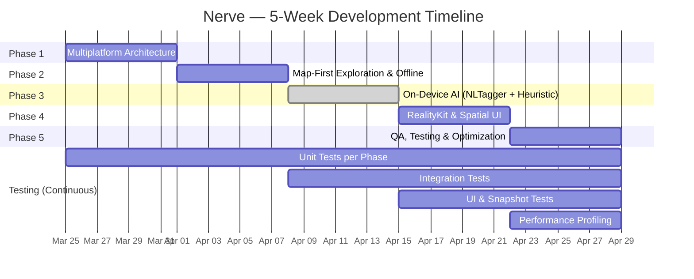
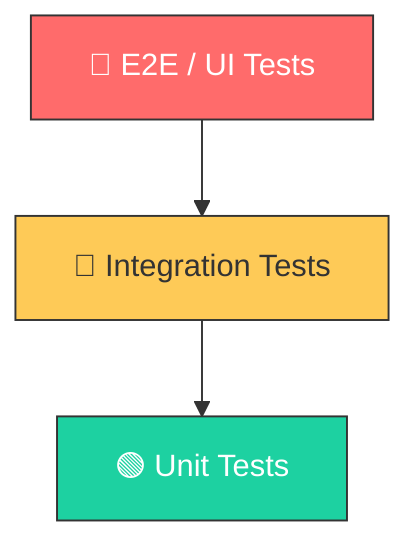

# Nerve — Development Roadmap

> **Timeline:** 5 Weeks  
> **Last Updated:** April 19, 2026  
> **Project Overview:** See [README.md](README.md)

---

This document is the **engineering execution plan** for Nerve. It details what to build, in what order, and the acceptance criteria for each phase. For project overview, architecture diagrams, and tech stack, refer to the [README](README.md).



---

## Phase 1 — Multiplatform Architecture & Modular Foundation

**Week 1 · March 25 – March 31, 2026**

### Goal

Establish a clean, scalable architecture that feeds iOS, macOS, and visionOS from a **single codebase** using Swift Package Manager (SPM) and Swift Concurrency.

### Technology Stack

| Technology                  | Purpose                                                  |
| --------------------------- | -------------------------------------------------------- |
| Swift Package Manager       | Modular dependency graph across all targets              |
| Swift Concurrency           | `async/await`, `Actor` isolation, structured concurrency |
| Xcode Multiplatform Targets | Unified project with iOS, macOS, visionOS destinations   |

> **Architecture:** See [README.md → Architecture](README.md#architecture) for the full module tree and data flow diagram.

### Deliverables

#### 1.1 — Project Bootstrapping

- [x] Create Xcode project with **iOS**, **macOS**, and **visionOS** targets.
- [x] Configure shared build settings (deployment targets, signing, capabilities) for all three platforms.
- [x] Set up `.xcode-version` and pin to a stable Xcode release for team consistency.

#### 1.2 — SPM Package Decomposition

- [x] Create six local SPM packages: `Core`, `NetworkLayer`, `StorageLayer`, `MapFeature`, `ARFeature`, `AILayer`.
- [x] Define `Package.swift` for each module with explicit platform declarations:

```swift
// Example: Core/Package.swift
let package = Package(
    name: "Core",
    platforms: [
        .iOS(.v17),
        .macOS(.v14),
        .visionOS(.v1)
    ],
    products: [
        .library(name: "Core", targets: ["Core"])
    ],
    targets: [
        .target(name: "Core"),
        .testTarget(name: "CoreTests", dependencies: ["Core"])
    ]
)
```

- [x] Establish the **dependency graph** between modules (e.g., `MapFeature` depends on `Core`, `NetworkLayer`, `StorageLayer`).
- [x] Validate that each package compiles independently for all three platform destinations.

#### 1.3 — Dependency Injection & UI Isolation

- [x] Implement a lightweight **DI Container** in `Core` (protocol-based, no third-party frameworks).
- [x] Define service protocols (e.g., `NewsServiceProtocol`, `LocationServiceProtocol`, `StorageServiceProtocol`) in `Core`.
- [x] Ensure **zero UIKit/SwiftUI imports** in `Core`, `NetworkLayer`, `StorageLayer`, and `AILayer`.
- [x] Wire up the container at the app-entry point (`NerveApp.swift`) using `@Environment` for SwiftUI injection.

#### 1.4 — Phase 1 Testing

- [x] Configure Swift Testing (`@Suite`, `@Test`) for all 6 package test targets.
- [x] Write unit tests for DI Container resolution and circular dependency detection.
- [x] Verify service protocol conformance with compile-time checks.
- [x] Validate all packages compile and test independently on all three platforms:

```bash
# CI Verification Script
for pkg in Core NetworkLayer StorageLayer MapFeature ARFeature AILayer; do
  swift test --package-path Packages/$pkg
done
```

### Acceptance Criteria

- [x] All six packages compile successfully for iOS, macOS, and visionOS.
- [x] `Core` module has no UI dependencies.
- [x] A trivial "Hello World" view renders on all three platforms using shared logic from `Core`.
- [x] All package test targets pass with `swift test`.

---

## Phase 2 — Map-First Exploration & Offline-First Data Layer

**Week 2 · April 1 – April 7, 2026**

### Goal

Transform the app's main screen into a **high-performance interactive map** that clusters hundreds of news annotations without frame drops, backed by a **SwiftData-powered offline-first** architecture.

### Technology Stack

| Technology                            | Purpose                                               |
| ------------------------------------- | ----------------------------------------------------- |
| MapKit                                | Interactive map rendering, custom annotations         |
| CoreLocation                          | User location tracking, geofencing                    |
| SwiftData                             | Local persistence, single source of truth             |
| Observation Framework (`@Observable`) | Reactive state management without Combine boilerplate |

### Deliverables

#### 2.1 — Annotation Clustering Engine

- [x] Implement a **quad-tree-based clustering algorithm** to group nearby news items into single bubble annotations.
- [x] Define a `ClusterAnnotation` model that holds aggregated metadata (count, dominant category, representative headline).
- [x] Dynamically re-cluster on zoom-level changes using `MKMapViewDelegate` region-change callbacks.
- [x] Optimize for **O(n log n)** clustering performance to handle 1,000+ annotations without janking the main thread.
- [x] Design custom `MKAnnotationView` subclasses with animated expand/collapse transitions.

```swift
// Clustering Strategy (Simplified)
actor AnnotationClusterer {
    func cluster(
        annotations: [NewsAnnotation],
        in region: MKCoordinateRegion,
        zoomLevel: Double
    ) -> [ClusterAnnotation] {
        // Quad-tree insertion → distance-based merge → return clusters
    }
}
```

#### 2.2 — SwiftData Persistence with Actor Safety

- [x] Define `@Model` schemas for `NewsItem` and `CachedRegion` in `StorageLayer`.
- [x] Create a dedicated `PersistenceActor` (Swift `actor`) to serialize all database writes, preventing data races.
- [x] Implement a **sync engine** that:
  1. Fetches news from the API via `NewsServiceProtocol`.
  2. Diffs incoming data against the local store.
  3. Merges updates using an **upsert** strategy (insert or update based on unique ID).
- [x] Add TTL (Time-To-Live) metadata to cached items for intelligent cache invalidation.

#### 2.3 — Offline-First UI Architecture

- [x] Configure the UI layer to use a **cache-first → network → re-cluster** pipeline in `MapViewModel`.
- [x] Add a `UIActivityIndicatorView` loading overlay directly on `MKMapView`.
- [x] Implement a self-dismissing `ErrorBannerView` for non-fatal network failures.
- [x] Ensure the map loads cached annotations immediately on cold start via `SeedData` fallback for offline/simulator use.

> **Data Flow:** See [README.md → Data Flow](README.md#data-flow) for the full sync and rendering pipeline diagram.

#### 2.4 — Phase 2 Testing

- [x] **StorageLayer Unit Tests:** `SwiftDataStorageService` tested with in-memory `ModelContainer` (upsert, fetch, delete, TTL prune — 19 tests).
- [x] **Clustering Unit Tests:** Quad-tree algorithm validated with known coordinate sets (30 tests across 5 suites).
- [x] **MapFeature Protocol Conformance Tests:** DI resolution, `Sendable` conformance verified.

### Acceptance Criteria

- [x] 1,000+ annotations cluster correctly; performance test validates **< 5ms** for the clustering pass.
- [x] Offline seed data (`SeedData.istanbulItems`) ensures the map is never blank, even in Airplane Mode.
- [x] No data races — `PersistenceActor` and `CoreLocationService` are Swift 6 Strict Concurrency compliant.
- [x] All Phase 2 unit tests pass (118 total: Core 45 + MapFeature 73).

---

## Phase 3 — On-Device AI with NLTagger + Heuristic Engine

**Week 3 · April 8 – April 14, 2026** — ✅ **COMPLETED**

### Goal

Integrate a **privacy-first**, on-device AI pipeline that analyzes news headlines for clickbait detection and sentiment scoring — running entirely on-device using Apple’s NaturalLanguage framework and a weighted heuristic engine, without any server round-trips.

### Technology Stack

| Technology       | Purpose                                            |
| ---------------- | -------------------------------------------------- |
| NaturalLanguage  | `NLTagger` sentiment analysis (50+ languages)      |
| Heuristic Engine | 6-signal weighted clickbait scoring (CoreML-ready) |
| Swift Actors     | Thread-safe, actor-isolated inference              |

### Deliverables

#### 3.1 — On-Device NLP Engine

- [x] Implement **`HeadlineAnalyzer` actor** with `NLTagger` for sentiment analysis (`.sentimentScore` tag scheme).
- [x] Implement **6-signal heuristic clickbait detection** engine (capitalization, punctuation, trigger phrases, listicle patterns, emotional words, length analysis).
- [x] Support **bilingual detection** — English and Turkish clickbait phrase libraries.
- [x] Target analysis speed: **< 1ms per headline** on-device.
- [x] Encapsulate all inference logic in `AILayer` behind `AIAnalysisServiceProtocol`:

```swift
// Actual implementation: AILayer/HeadlineAnalyzer.swift
public actor HeadlineAnalyzer: AIAnalysisServiceProtocol {
  public func analyzeHeadline(_ headline: String) async throws -> HeadlineAnalysis
  public func analyzeBatch(_ headlines: [String]) async throws -> [HeadlineAnalysis]
}

// Core/Models/HeadlineAnalysis.swift
public struct HeadlineAnalysis: Sendable {
  public let clickbaitScore: Double      // 0.0 (genuine) → 1.0 (clickbait)
  public let sentiment: Sentiment        // .positive, .neutral, .negative
  public let confidence: Double          // Engine confidence level
  public var credibilityLabel: CredibilityLabel { … }
}
```

#### 3.2 — Background Analysis Pipeline

- [x] Hook into the data pipeline from Phase 2: when new articles arrive via `loadNews()`, enqueue them for AI analysis via `scheduleAnalysis()`.
- [x] Process analysis on a **background `TaskGroup`** with concurrency limit (`maxConcurrency = 4`) to avoid saturating the system.
- [x] Persist analysis results alongside `NewsItem` in SwiftData (`clickbaitScore`, `sentiment`, `confidence`).
- [x] Implement a **batch processing strategy** (`analyzeBatch()`) for concurrent multi-headline analysis.

```swift
// Actual implementation in MapViewModel.swift
private func scheduleAnalysis(
  _ items: [NewsItem],
  in region: GeoRegion,
  zoomLevel: Double
) {
  guard let aiService else { return }
  let unanalyzed = items.filter { $0.analysis == nil }
  guard !unanalyzed.isEmpty else { return }

  analyzeTask = Task(priority: .userInitiated) { @MainActor [weak self] in
    let headlines = unanalyzed.map(\.headline)
    let analyses = try await aiService.analyzeBatch(headlines)
    // Enrich → merge → re-cluster → persist
  }
}
```

#### 3.3 — Credibility Tags on Map Annotations

- [x] Map annotation views display **color-coded credibility badges** (implemented in Phase 2 `NewsAnnotationView`):

| Badge        | Condition                 | Color |
| ------------ | ------------------------- | ----- |
| ✅ Verified  | Clickbait score < 0.3     | Green |
| ⚠️ Caution   | Clickbait score 0.3 – 0.7 | Amber |
| 🚫 Clickbait | Clickbait score > 0.7     | Red   |

- [x] Sentiment indicator displayed in `NewsDetailSheet` with color-coded labels.
- [x] `SeedData` enriched with pre-computed `HeadlineAnalysis` for immediate credibility badge rendering.

#### 3.4 — Phase 3 Testing

- [x] **AILayer Unit Tests:** 24 tests across 6 suites covering clickbait detection, sentiment analysis, batch processing, edge cases, and DI integration:

```swift
@Suite("HeadlineAnalyzer Clickbait Detection")
struct HeadlineAnalyzerClickbaitTests {
  let analyzer = HeadlineAnalyzer()

  @Test("Known clickbait phrases produce elevated score")
  func clickbaitPhrases() async throws {
    let result = try await analyzer.analyzeHeadline(
      "YOU WON'T BELIEVE What Scientists Discovered! This One Trick Is SHOCKING!!!"
    )
    #expect(result.clickbaitScore > 0.4)
  }

  @Test("Genuine news headline scores below 0.3")
  func genuineHeadline() async throws {
    let result = try await analyzer.analyzeHeadline(
      "Istanbul Municipality Announces New Metro Line Extension"
    )
    #expect(result.clickbaitScore < 0.3)
    #expect(result.credibilityLabel == .verified)
  }
}
```

- [x] **Edge Case Tests:** Empty strings, whitespace-only, non-Latin scripts (Arabic), emoji-heavy headlines, 500+ char headlines.
- [x] **Batch Tests:** Correct count, empty batch, input ordering preserved, 50-item large batch.
- [x] **DI Integration Test:** `HeadlineAnalyzer` resolved via `DependencyContainer` round-trip.
- [x] **Module Version Test:** `AILayer.version == "1.0.0"`.

### Acceptance Criteria

- [x] Headline analysis completes in **< 1ms per headline** (24 tests pass in < 0.5s total).
- [x] Zero network calls made during the analysis pipeline.
- [x] Credibility badges render correctly on clustered and individual annotations.
- [x] All 142 tests pass: Core (45) + MapFeature (73) + AILayer (24).

---

## Phase 4 — RealityKit & visionOS Spatial UI

**Week 4 · April 15 – April 21, 2026**

### Goal

Deliver the **"wow factor"** — bring news stories to life with AR on iOS/macOS and Spatial Computing on visionOS, showcasing Apple's most advanced rendering capabilities.

### Technology Stack

| Technology                         | Purpose                                             |
| ---------------------------------- | --------------------------------------------------- |
| RealityKit                         | 3D rendering, physics, entity-component system      |
| ARKit                              | Camera-based AR on iOS (plane detection, anchoring) |
| SwiftUI Volumes & Immersive Spaces | visionOS spatial UI paradigms                       |
| USDZ                               | Universal 3D asset format                           |

### Deliverables

#### 4.1 — iOS/macOS: AR News Viewer

- [ ] Implement an `ARNewsViewController` that activates when a user taps an AR-eligible story (e.g., tech product launch).
- [ ] Use ARKit **plane detection** to anchor a 3D USDZ model on a detected horizontal surface (table, desk).
- [ ] Integrate gesture recognizers for **rotate**, **scale**, and **reposition** interactions.
- [ ] Add an informational **SwiftUI overlay** with headline, source, and credibility badge rendered as a floating card.
- [ ] Implement graceful degradation: devices without AR capability show a 3D model viewer (SceneKit fallback).

```swift
struct ARNewsView: View {
    let newsItem: NewsItem
    @State private var arSession = ARSession()

    var body: some View {
        RealityView { content in
            if let model = try? await Entity(named: newsItem.modelName) {
                model.position = [0, 0, -0.5]
                model.generateCollisionShapes(recursive: true)
                content.add(model)
            }
        }
        .gesture(
            DragGesture()
                .targetedToAnyEntity()
                .onChanged { value in
                    value.entity.position = value.convert(
                        value.location3D, from: .local, to: .scene
                    )
                }
        )
    }
}
```

#### 4.2 — visionOS: Volumetric News Explorer

- [ ] Create a **Volumetric Window** that detaches 3D news models from the 2D interface into the user's physical space.
- [ ] Implement `WindowGroup` with `.windowStyle(.volumetric)` for spatial content:

```swift
@main
struct NerveApp: App {
    var body: some Scene {
        // Standard 2D window
        WindowGroup {
            ContentView()
        }

        // 3D volumetric news viewer
        WindowGroup(id: "news-3d-viewer") {
            VolumetricNewsView()
        }
        .windowStyle(.volumetric)
        .defaultSize(width: 0.5, height: 0.5, depth: 0.5, in: .meters)
    }
}
```

- [ ] Build an **Immersive Space** for the spatial map experience:
  - Render the news map as a topographical 3D surface the user can walk around.
  - News annotations become floating 3D tags hovering above their geographic locations.
  - Implement **gaze + pinch** interaction for selecting annotations in visionOS.

```swift
ImmersiveSpace(id: "spatial-map") {
    SpatialMapView()
}
.immersionStyle(selection: .constant(.mixed), in: .mixed)
```

- [ ] Implement smooth **transitions** between 2D window → Volumetric Window → Immersive Space.
- [ ] Add **spatial audio** cues for annotation selection and model interaction events.

#### 4.3 — 3D Asset Pipeline

- [ ] Source or create **3 – 5 USDZ models** as demonstration assets (tech gadgets, landmarks, etc.).
- [ ] Implement an asset caching layer to avoid re-downloading models on repeat views.
- [ ] Add loading states with animated placeholder entities during model fetch.

#### 4.4 — Phase 4 Testing

- [ ] **ARFeature Unit Tests:** Test entity lifecycle (create → load → destroy) with mock scenes.
- [ ] **Snapshot Tests:** Capture reference images for AR overlay UI and volumetric views.
- [ ] **Gesture Tests:** Validate drag, rotate, and scale gesture handlers with synthetic input events.
- [ ] **Memory Profiling:** Profile VRAM allocation/deallocation during model load/unload cycles.
- [ ] **visionOS Simulator Tests:** Validate spatial map rendering and window transitions.

### Acceptance Criteria

- [ ] AR model anchors correctly to a detected surface on iPhone/iPad.
- [ ] Volumetric window renders USDZ models with correct lighting and shadows on visionOS.
- [ ] Immersive map space is navigable with gaze + pinch and does not cause simulator/device crashes.
- [ ] All ARFeature tests pass; zero VRAM leaks detected in profiling.

---

## Phase 5 — Quality Assurance, Testing & Optimization

**Week 5 · April 22 – April 28, 2026**

### Goal

Harden the codebase for **production release** with comprehensive testing, memory profiling, and GPU optimization — ensuring the app is bulletproof under real-world conditions.

### Technology Stack

| Technology                        | Purpose                                |
| --------------------------------- | -------------------------------------- |
| Swift Testing (`@Test`, `@Suite`) | Modern unit testing framework          |
| XCUITest                          | End-to-end UI automation               |
| Xcode Instruments                 | Leaks, Allocations, Metal System Trace |
| Thread Sanitizer (TSan)           | Data race detection                    |

### Deliverables

#### 5.1 — Unit Testing with Mock Services

- [ ] Write unit tests for `NetworkLayer` using a `MockURLProtocol` — zero real network calls:

```swift
@Suite("NetworkLayer Tests")
struct NetworkLayerTests {
    let sut: NewsAPIClient
    let mockSession: URLSession

    init() {
        let config = URLSessionConfiguration.ephemeral
        config.protocolClasses = [MockURLProtocol.self]
        mockSession = URLSession(configuration: config)
        sut = NewsAPIClient(session: mockSession)
    }

    @Test("Fetches and decodes news items correctly")
    func fetchNews() async throws {
        MockURLProtocol.stubResponseData = NewsFixtures.validJSON
        let items = try await sut.fetchNews(for: .sanFrancisco)
        #expect(items.count == 10)
        #expect(items.first?.headline == "Breaking: Tech Summit 2026")
    }

    @Test("Handles network timeout gracefully")
    func networkTimeout() async {
        MockURLProtocol.stubError = URLError(.timedOut)
        await #expect(throws: NetworkError.timeout) {
            try await sut.fetchNews(for: .sanFrancisco)
        }
    }
}
```

- [ ] Write unit tests for `AILayer` with pre-computed model outputs to validate scoring logic.
- [ ] Achieve **> 80% code coverage** for `Core`, `NetworkLayer`, `StorageLayer`, and `AILayer`.

#### 5.2 — End-to-End UI Tests

- [ ] Automate the **primary user flow** with XCUITest:
  1. App launch → Map loads with cached/fetched annotations.
  2. Zoom into a cluster → Cluster expands into individual annotations.
  3. Tap an annotation → Detail view appears with credibility badge.
  4. Toggle Airplane Mode → Map retains all annotations, sync indicator shows "Offline."
  5. Re-enable connectivity → New articles sync, map updates.

- [ ] Create a **snapshot test** for annotation views to catch visual regressions.
- [ ] Test accessibility: all interactive elements have proper `accessibilityLabel` and `accessibilityHint`.

#### 5.3 — Performance Profiling & Optimization

- [ ] **Memory Leaks (Instruments → Leaks)**
  - Profile the map scrolling scenario: rapidly pan across regions, zoom in/out repeatedly.
  - Identify and fix any retain cycles in closures, delegates, or `@Observable` objects.
  - Target: **zero leaks** in a 5-minute continuous usage session.

- [ ] **GPU/VRAM (Instruments → Metal System Trace)**
  - Profile AR model loading and unloading: open model → close → reopen cycle.
  - Verify that VRAM is fully reclaimed after dismissing 3D models.
  - Validate that RealityKit entity hierarchies are properly destroyed (no orphan entities).

- [ ] **CPU / Hang Detection (Instruments → Time Profiler + Hangs)**
  - Ensure zero main-thread hangs exceeding **250ms**.
  - Verify that clustering, sync, and AI analysis are entirely off the main thread.

- [ ] **Network Efficiency**
  - Validate that API pagination and conditional requests (`ETag` / `If-Modified-Since`) minimize bandwidth usage.

> **Performance Budgets:** See [README.md → Performance Targets](README.md#performance-targets) for the full metrics table.

### Acceptance Criteria

- [ ] All unit tests pass on CI for all three platforms.
- [ ] XCUITest suite passes on iPhone 15 Pro simulator and macOS.
- [ ] Zero memory leaks reported by Instruments in the profiling scenarios.
- [ ] VRAM properly released after AR/3D model teardown.
- [ ] No main-thread hangs > 250ms detected during profiling.

---

## Testing Strategy

Nerve follows a **shift-left testing philosophy** — testing is not a final phase activity but an integral part of every development cycle. Each phase includes dedicated testing deliverables.

### Test Pyramid



| Layer           | Scope                       | Target                        | Runner                            |
| --------------- | --------------------------- | ----------------------------- | --------------------------------- |
| **Unit**        | Single module in isolation  | ≥ 80% coverage per module     | Swift Testing (`@Test`, `@Suite`) |
| **Integration** | Cross-module data flow      | Sync pipeline, DI container   | Swift Testing + in-memory stores  |
| **UI / E2E**    | Full user journeys          | Critical paths                | XCUITest                          |
| **Snapshot**    | Visual regression detection | Annotation views, AR overlays | `swift-snapshot-testing`          |
| **Performance** | Latency & resource budgets  | CPU, GPU, memory, network     | `XCTMetric`, Instruments          |

### Coverage Policy

| Module         | Min Coverage | Rationale                                              |
| -------------- | ------------ | ------------------------------------------------------ |
| `Core`         | **90%**      | Foundation layer — bugs cascade everywhere             |
| `NetworkLayer` | **85%**      | Data integrity is critical                             |
| `StorageLayer` | **85%**      | Persistence bugs cause data loss                       |
| `AILayer`      | **80%**      | Model output validation                                |
| `MapFeature`   | **70%**      | Heavy UI — tested via snapshots + integration          |
| `ARFeature`    | **60%**      | Hardware-dependent — relies on manual + snapshot tests |

### Mock Infrastructure

All external dependencies are abstracted behind protocols defined in `Core`, enabling deterministic testing:

```swift
// Core/Protocols/NewsServiceProtocol.swift
public protocol NewsServiceProtocol: Sendable {
  func fetchNews(for region: GeoRegion) async throws -> [NewsItem]
}

// CoreTests/Mocks/MockNewsService.swift
final class MockNewsService: NewsServiceProtocol {
  var stubbedResult: Result<[NewsItem], Error> = .success([])

  func fetchNews(for region: GeoRegion) async throws -> [NewsItem] {
    try stubbedResult.get()
  }
}
```

### Test Execution Matrix

| Platform               | Unit Tests | Integration Tests | UI Tests   | Performance |
| ---------------------- | ---------- | ----------------- | ---------- | ----------- |
| **iOS Simulator**      | ✅         | ✅                | ✅         | ✅          |
| **macOS**              | ✅         | ✅                | ✅         | ✅          |
| **visionOS Simulator** | ✅         | ✅                | ⚠️ Limited | ⚠️ Limited  |

---

## Cross-Cutting Concerns

These items span all phases and should be addressed continuously:

### Code Quality

- [x] Require **Swift Concurrency strict checking** (`SWIFT_STRICT_CONCURRENCY = complete`).
- [ ] Enforce **SwiftLint** with a shared configuration across all packages.
- [x] Maintain clear documentation via inline `///` doc comments on all public APIs.

### CI/CD Pipeline

- [ ] Configure GitHub Actions (or Xcode Cloud) to build & test all three platform targets on every PR.
- [ ] Automate SwiftLint checks as a CI gate.
- [ ] Set up code coverage reporting with a **minimum threshold of 80%**.
- [ ] Run Thread Sanitizer (TSan) on every PR to catch data races early.
- [ ] Fail the build if any test target drops below its minimum coverage threshold.

### Accessibility

- [ ] Ensure VoiceOver compatibility on all interactive map elements.
- [ ] Support Dynamic Type for all text content.
- [ ] Test with Switch Control and Voice Control.

### Localization

- [ ] Use `String(localized:)` from day one for all user-facing strings.
- [ ] Prepare `.xcstrings` catalog for future language expansions.

---

## Risk Register

| Risk                                                 | Impact | Likelihood | Mitigation                                                               |
| ---------------------------------------------------- | ------ | ---------- | ------------------------------------------------------------------------ |
| CoreML model accuracy is insufficient                | Medium | Low        | Heuristic engine deployed as v1.0; CoreML swap ready behind protocol     |
| visionOS simulator limitations mask real-device bugs | High   | High       | Prioritize early access to Apple Vision Pro hardware for testing         |
| Annotation clustering degrades at 10k+ items         | Medium | Low        | Implement server-side pre-clustering; progressive loading by viewport    |
| SwiftData performance on large datasets              | Medium | Medium     | Profile early; add indexes on queried fields; consider batch fetch sizes |
| 3D asset (USDZ) licensing and availability           | Low    | Medium     | Create placeholder models; partner with 3D asset providers               |

---

## Definition of Done (Per Phase)

Each phase is considered **complete** when:

1. ✅ All deliverables are implemented and code-reviewed.
2. ✅ Unit tests pass for all affected modules.
3. ✅ The app builds and runs on all three platform targets.
4. ✅ No regressions in previously completed phases.
5. ✅ Code merged to `main` with a clean CI pipeline.

---

> **Note:** This roadmap assumes a single senior developer workload. Timelines are aggressive but achievable with disciplined time-boxing and scope management. Phase deliverables are **MVP-scoped** — each can be iteratively enhanced post-launch.
