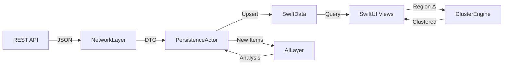

<h1 align="center">Nerve</h1>

<p align="center">
  <strong>Spatial News Intelligence — See the World's Pulse in Real Time</strong>
</p>

<p align="center">
  
  
  
  
  
</p>

---

## Overview

**Nerve** is a multiplatform Apple application that reimagines how people discover news. Instead of an endless scroll of headlines, Nerve places stories on a **live, interactive map** — letting you explore what's happening around the globe through geography. Every headline is enriched with **on-device AI** that flags clickbait and analyzes sentiment, all without sending a single byte to external servers. On supported devices, the experience extends into **Augmented Reality** (iOS) and **Spatial Computing** (visionOS), bringing news stories to life in 3D.

### Key Pillars

| Pillar                               | Description                                                              |
| ------------------------------------ | ------------------------------------------------------------------------ |
| 🗺️ **Map-First Discovery**           | Explore news geographically on an interactive, clustered map             |
| 🔒 **Privacy-First AI**              | CoreML-powered clickbait detection & sentiment analysis — 100% on-device |
| ✈️ **Offline-First**                 | Full functionality without internet via SwiftData persistence            |
| 🥽 **Spatial Computing**             | Volumetric 3D models & immersive map on visionOS                         |
| 📱 **One Codebase, Three Platforms** | iOS · macOS · visionOS powered by Swift Package Manager                  |

---

## Features

### 🗺️ Interactive News Map

- Real-time news annotations plotted on a full MapKit interface.
- **Annotation Clustering** — hundreds of stories grouped intelligently without performance degradation.
- Smooth expand/collapse animations when zooming into clusters.
- Pull-to-refresh with background sync.

### 🤖 On-Device AI Analysis

- **Clickbait Detection** — binary classification scoring each headline's credibility.
- **Sentiment Analysis** — categorizes headlines as positive, neutral, or negative.
- Color-coded credibility badges on every annotation (✅ Verified · ⚠️ Caution · 🚫 Clickbait).
- Filter controls to hide low-credibility stories.

### ✈️ Offline-First Architecture

- All news data persisted locally via SwiftData.
- UI observes the local store exclusively — **never** raw API responses.
- Instant cold-start with cached data, even in Airplane Mode.
- Visual sync-status indicator (Online · Syncing · Offline).

### 🧊 Augmented Reality (iOS)

- Tap AR-eligible stories to render 3D USDZ models anchored to real-world surfaces.
- Gesture support: rotate, scale, and reposition models.
- Informational overlay with headline, source, and credibility badge.

### 🥽 Spatial Computing (visionOS)

- **Volumetric Windows** — detach 3D news models into your physical space.
- **Immersive Map** — walk around a topographical news landscape.
- Gaze + pinch interaction for selecting spatial annotations.
- Spatial audio feedback on interaction events.

---

## Architecture

Nerve follows a **modular, protocol-oriented architecture** powered by Swift Package Manager. All business logic is completely decoupled from UI through dependency injection.

```
Nerve/
├── NerveApp (iOS)
├── NerveApp (macOS)
├── NerveApp (visionOS)
│
└── Packages/
    ├── Core/            → Shared models, protocols, DI container
    ├── NetworkLayer/    → API client, request builders, interceptors
    ├── StorageLayer/    → SwiftData schemas, persistence actors
    ├── MapFeature/      → Map UI, clustering engine, location services
    ├── ARFeature/       → RealityKit scenes, USDZ management, AR sessions
    └── AILayer/         → CoreML inference, NLP pipelines, scoring engine
```

### Data Flow



### Design Principles

- **Single Source of Truth** — SwiftData is the only data layer the UI reads from.
- **Actor Isolation** — All concurrent data access goes through Swift `actor` types to eliminate data races.
- **Protocol-Driven DI** — Every service is defined by a protocol in `Core`, enabling mock injection for testing.
- **Platform Abstraction** — Feature modules use `#if os(...)` only at the view layer; logic remains universal.

---

## Tech Stack

| Category         | Technology                                          |
| ---------------- | --------------------------------------------------- |
| **Language**     | Swift 5.9+                                          |
| **UI Framework** | SwiftUI                                             |
| **Persistence**  | SwiftData                                           |
| **Maps**         | MapKit, CoreLocation                                |
| **AI / ML**      | CoreML, NaturalLanguage                             |
| **3D / AR**      | RealityKit, ARKit                                   |
| **Spatial**      | visionOS Volumes & Immersive Spaces                 |
| **Concurrency**  | Swift Concurrency (async/await, Actors, TaskGroups) |
| **Reactivity**   | Observation Framework (`@Observable`)               |
| **Modularity**   | Swift Package Manager (local packages)              |
| **Testing**      | Swift Testing (`@Test`), XCUITest                   |
| **Profiling**    | Xcode Instruments (Leaks, Metal System Trace)       |
| **Linting**      | SwiftLint                                           |

---

## Requirements

| Requirement                | Minimum                                      |
| -------------------------- | -------------------------------------------- |
| Xcode                      | 15.0+                                        |
| Swift                      | 5.9+                                         |
| iOS Deployment Target      | 17.0                                         |
| macOS Deployment Target    | 14.0                                         |
| visionOS Deployment Target | 1.0                                          |
| Apple Developer Account    | Required for on-device testing & AR features |

---

## Getting Started

### 1. Clone the Repository

```bash
git clone https://github.com/MrDavudGunduz/Nerve.git
cd Nerve
```

### 2. Open in Xcode

```bash
open Nerve.xcodeproj
```

### 3. Resolve Packages

Xcode will automatically resolve all local SPM dependencies. If not, go to:

**File → Packages → Resolve Package Versions**

### 4. Select a Target & Run

| Target             | Simulator / Device                         |
| ------------------ | ------------------------------------------ |
| `Nerve (iOS)`      | iPhone 15 Pro Simulator or physical device |
| `Nerve (macOS)`    | My Mac                                     |
| `Nerve (visionOS)` | Apple Vision Pro Simulator                 |

Press `⌘R` to build and run.

### 5. Run Tests

```bash
# Unit tests (all platforms)
xcodebuild test \
  -scheme Nerve \
  -destination 'platform=iOS Simulator,name=iPhone 15 Pro'

# UI tests
xcodebuild test \
  -scheme NerveUITests \
  -destination 'platform=iOS Simulator,name=iPhone 15 Pro'
```

---

## Project Structure

```
Nerve/
├── Nerve/                          # Main app target
│   ├── NerveApp.swift              # App entry point & DI configuration
│   ├── ContentView.swift           # Root view with navigation
│   ├── Assets.xcassets/            # App icons, colors, images
│   └── ...
│
├── Packages/
│   ├── Core/                       # Shared foundation
│   │   ├── Models/                 # Domain models
│   │   ├── Protocols/              # Service contracts
│   │   └── DI/                     # Dependency injection container
│   │
│   ├── NetworkLayer/               # Networking
│   │   ├── APIClient/              # URLSession-based client
│   │   ├── DTOs/                   # Data transfer objects
│   │   └── Interceptors/          # Auth, logging, retry logic
│   │
│   ├── StorageLayer/               # Persistence
│   │   ├── Schemas/                # SwiftData @Model definitions
│   │   ├── Actors/                 # Thread-safe persistence actors
│   │   └── Migrations/            # Schema versioning
│   │
│   ├── MapFeature/                 # Map module
│   │   ├── Views/                  # Map UI components
│   │   ├── Clustering/             # Quad-tree annotation clustering
│   │   └── ViewModels/             # Map state management
│   │
│   ├── ARFeature/                  # AR & 3D module
│   │   ├── ARViews/                # RealityKit view wrappers
│   │   ├── Models/                 # USDZ asset management
│   │   └── Spatial/                # visionOS volumes & spaces
│   │
│   └── AILayer/                    # Intelligence module
│       ├── Models/                 # CoreML model wrappers
│       ├── Pipeline/               # Batch analysis engine
│       └── Scoring/                # Credibility scoring logic
│
├── NerveTests/                     # Unit tests
├── NerveUITests/                   # UI automation tests
├── DEVELOPMENT_ROADMAP.md          # Detailed development plan
└── README.md                       # ← You are here
```

---

## Performance Targets

| Metric                           | Target          |
| -------------------------------- | --------------- |
| Cold launch → interactive map    | < 2 seconds     |
| Annotation clustering (1K items) | < 100ms         |
| AI analysis per headline         | < 50ms          |
| Map idle memory footprint        | < 80 MB         |
| AR frame time                    | < 16ms (60 FPS) |

---

## Testing Strategy

| Layer           | Framework               | Approach                                                                |
| --------------- | ----------------------- | ----------------------------------------------------------------------- |
| **Unit Tests**  | Swift Testing (`@Test`) | Mock services via protocol injection; zero network dependency           |
| **UI Tests**    | XCUITest                | End-to-end flows: map navigation, offline fallback, cluster interaction |
| **Performance** | Xcode Instruments       | Memory leaks, GPU profiling, hang detection                             |
| **Concurrency** | Thread Sanitizer        | Data race detection across all actor boundaries                         |

---

## Roadmap

See [DEVELOPMENT_ROADMAP.md](DEVELOPMENT_ROADMAP.md) for the full 5-phase implementation plan:

| Phase | Focus                                           | Timeline |
| ----- | ----------------------------------------------- | -------- |
| **1** | Multiplatform Architecture & Modular Foundation | Week 1   |
| **2** | Map-First Exploration & Offline-First           | Week 2   |
| **3** | On-Device AI with CoreML                        | Week 3   |
| **4** | RealityKit & visionOS Spatial UI                | Week 4   |
| **5** | QA, Testing & Optimization                      | Week 5   |

---

## Contributing

1. Fork the repository.
2. Create a feature branch: `git checkout -b feature/amazing-feature`
3. Commit with [Conventional Commits](https://www.conventionalcommits.org/): `git commit -m "feat: add spatial map clustering"`
4. Push to your branch: `git push origin feature/amazing-feature`
5. Open a Pull Request.

### Code Standards

- Follow [Swift API Design Guidelines](https://www.swift.org/documentation/api-design-guidelines/).
- All public APIs must have `///` documentation comments.
- SwiftLint must pass with zero violations.
- Minimum 80% code coverage on `Core`, `NetworkLayer`, `StorageLayer`, `AILayer`.
- Enable strict concurrency checking: `SWIFT_STRICT_CONCURRENCY = complete`.

---

## License

This project is licensed under the **MIT License** — see the [LICENSE](LICENSE) file for details.

---

## Author

**Davud Gündüz**  
iOS Developer

[](https://github.com/MrDavudGunduz)

---

<p align="center">
  Built with ❤️ using Swift, SwiftUI, and the Apple ecosystem.
</p>
